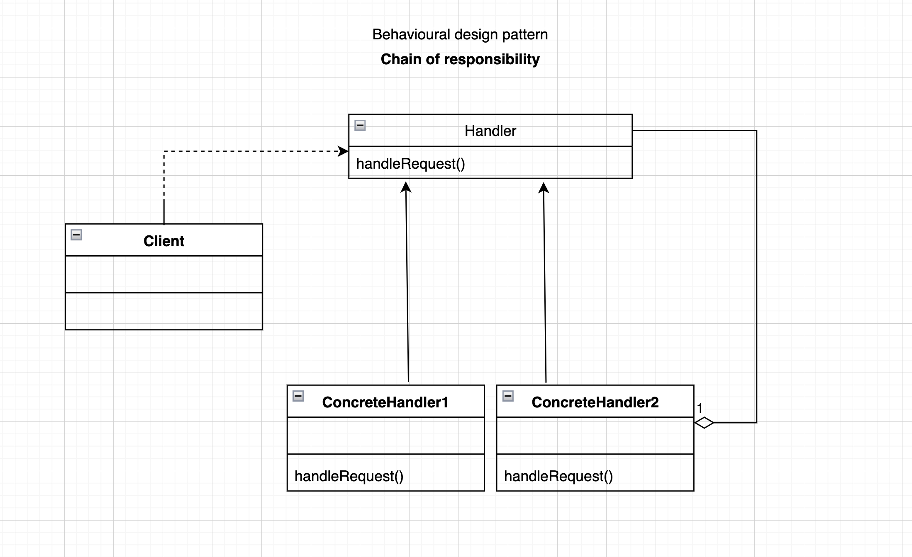

# Chain of responsibility pattern.

### Overview
This is a behavioural pattern that decouples a request from a handling 
object in a chain of handlers until it is finally recognised.

### Concepts
- Decoupling of sender and receiver. Often time in an application we want to parse a request to a receiving object 
without knowing who the sender was and vice versa. 
- Sender should not know who the receiver was before processing the request.
- Receiver contains reference to the next receiver or the successor. It doesn't know the whole hierarchy but it does know who is
next in line.
- No handler -OK. There may not be a handler for a given request and the application will just continue

### Examples:
- java.util.logging.Logger#log() api
- javax.servlet.Filte#doFilter() api
- spring security filter chain is one of the greatest example of this principle
