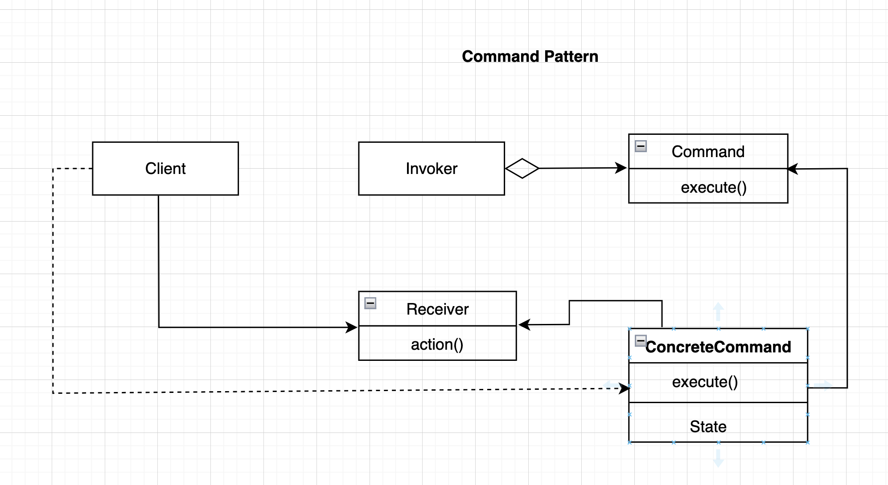

# Command pattern.

### Overview
This is a behavioural pattern that encapsulates each request as an objects

### Concepts
- Encapsulates each request as an object. 
- Requests are object-oriented callback. making it easy to achieve loose coupling
- The sender is decoupled from the processor
- It can be use to add "undo" functionality to an application

### Examples:
- java.lang.Runnable api
- javax.swing.Action api
