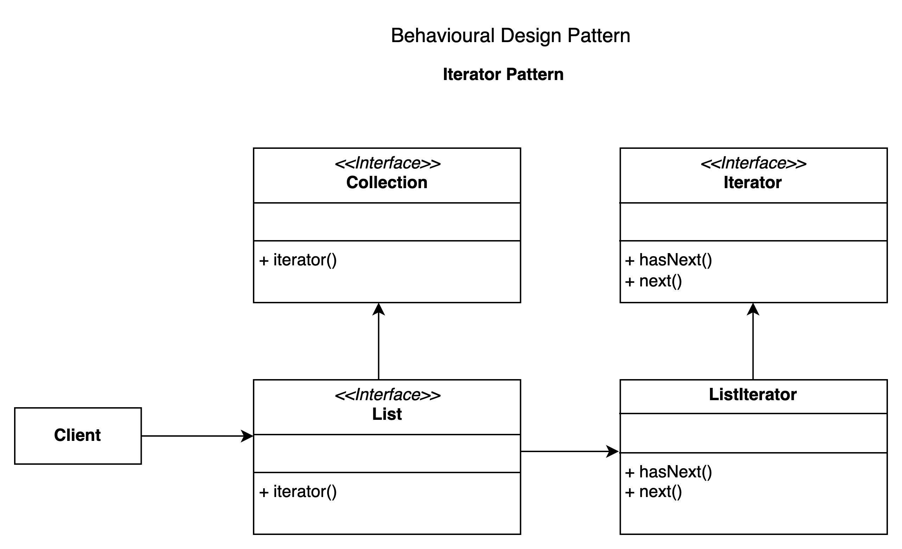

# Interpreter pattern.

### Overview
This is a behavioural pattern that you can use to navigate without exposing the structure of an object

### Concepts
- You need to traverse a container. The notion of a collection e.g list, map, set etc
- Don't expose the underlying structure
- Decouples the data from the algorithms used to traverse it
- They are sequential in nature. Not all objects have a sequential sets of data.
  - Iterators handles the navigation in an order that best represents its sequence

### Examples:
- java.util.Iterator api - built in iterator
- javax.util.Enumeration api 

The design of the iterator is 
- interface based
- Factory method based
- independent, but fail fast (fail fast means two iterators can modify the underlying iterator without an error being thrown)
  - Iterator don't know about the other iterators 
- Enumerators are fail safe.
