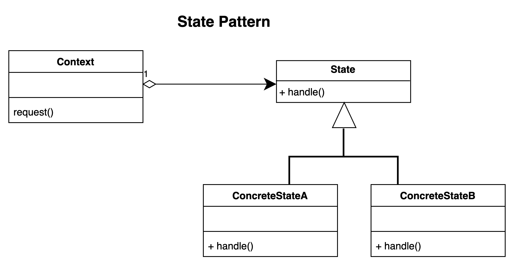

# State pattern.

### Overview
The state pattern is used when you need to represent states in an application.

### Concepts
- Localize a state specific behaviour
- State object
- Help to separate with state we are in from where we are at our application
- It effectively make sure objects follows the open close principle of the SOLID principle

### Design:
- A subject that needs to be observed. The subject is a class that the observers would need to register themselves with.
    - In the case of java, the subject implements an observable interface
- The Observer is interface based with various concrete implementation
- Concrete Observers are typically views in an event driven application
