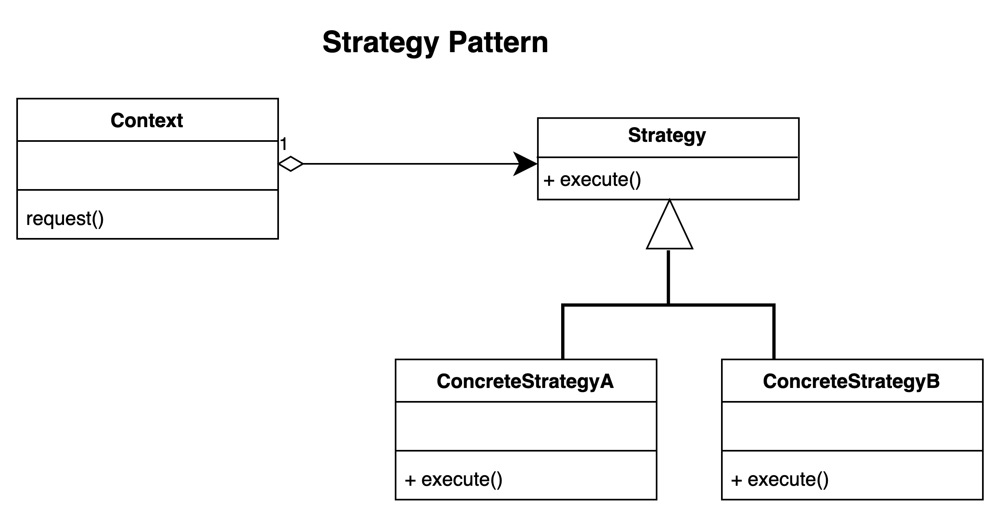

# Strategy pattern.

### Overview
The strategy pattern is a behavioural pattern that is used when you 
want to enable the strategy or algorithm to be selected at runtime. 

### Concepts
- When there is a need or you want to eliminate conditional statements in your application.
- It encapsulates the behaviour in the individual class that contains the algorithm 
   which eliminates the conditional statement in the main application
- Client chooses the strategy
- Should be considered when there is difficulty in adding new strategy to an application 
  - With it, algorithms can be externalize 

### Examples
- java.util.Comparator API 
  - use when a collection needs to sorted by object strategy

### Design:
- Usually with an abstract base class (also possible with an interface)
- Concrete class per strategy
- Client knows about the strategies
- The strategies are independent of each other

- ### Summary
- Externalize algorithms
- Client usually know about the different strategy available
- Class per strategy
- Reduce conditional statements