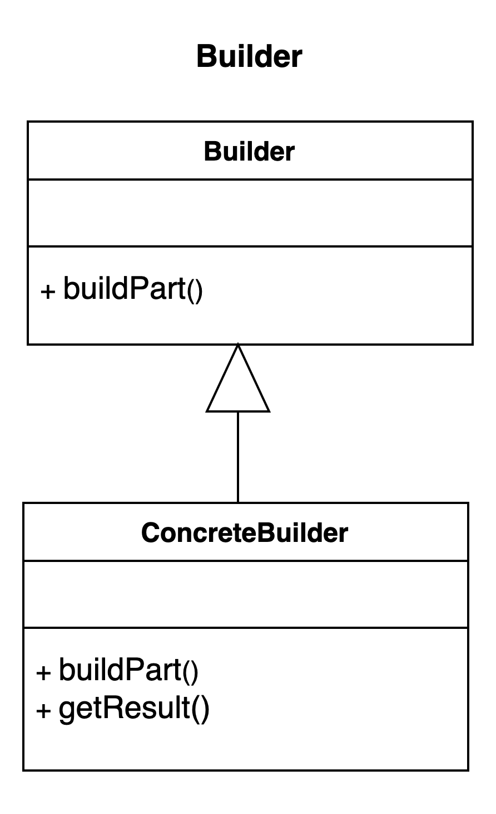

# Builder pattern.

### Overview
It is a creational design pattern that is used for handling the construction of objects that may 
contain a lot of parameter. It is solves one basic problem in OOP and that is determining what
constructor to use.

### Concepts
- Whether or not the constructor of an object is complex
- Large number of parameters
- You can enforce immutability with the builder

### Examples:
- StringBuilder
- DocumentBuilder
- Locale.Builder

### Design:
- Builder pattern creates flexibility over telescoping constructors 
  - Telescoping constructor - the creation of multiple constructor with each parameter variation
- The builder is typically written with a static inner class
- Negates the need for exposed setters