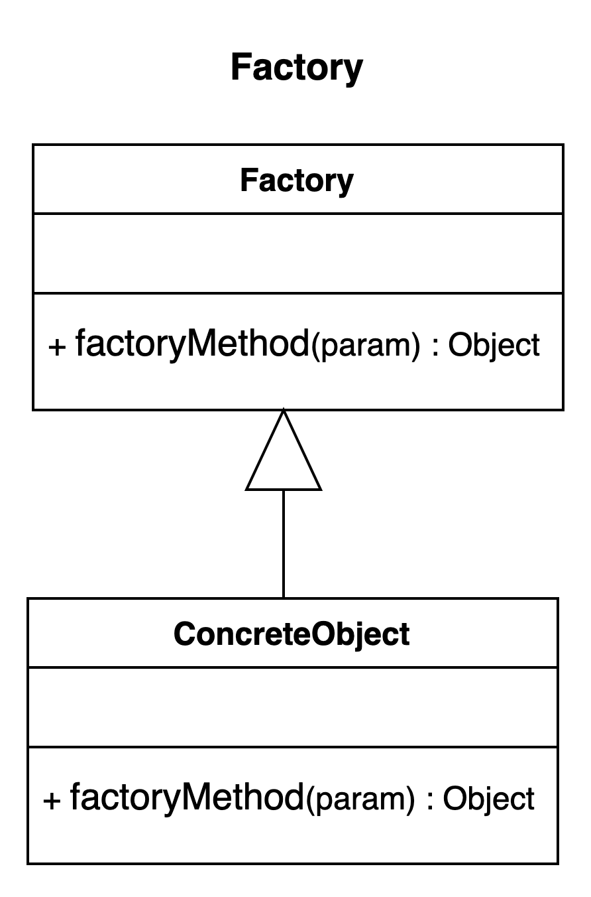

# Factory Method pattern.

### Overview
It is an like the opposite of the singleton pattern and the second most used creational design pattern.

### Concepts
- It does not expose its instantiation logic
- The client knows next to nothing about even the objects type that is been created
- It is able to do this by deferring the object instantiation logic to the subclasses.
- All the client typically knows about is the common interface that the factory exposes
- They are often time implemented by an architectural framework and the usage by a user of that framework
  - the implementation allow the flexibility of the object creation to be determine by the client/user

### Examples:
- Calender - Is static factory
- ResourceBundle  - depending on the logger implementation, it could be a factory instead of a singleton
- NumberFormat

### Design:
- The factory class is responsible for creating instances and managing the lifecycle of the created objects
- Objects are created in reference through a common interface
- They reference multiple concrete classes through the common interface but the client are often unaware of it
- The method to request an object is typically parameterized