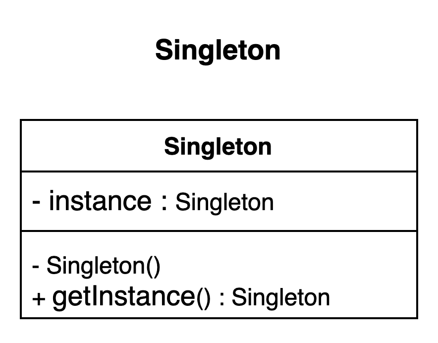

# Singleton pattern.

### Overview
It is a creational design pattern that is one of the most widely used design pattern because of its simplicity. 
It ensures only one instance of one instance of an object is available throughout 
an application context/lifecycle

### Concepts
- It guarantee only one instance is created
- It guarantees the control of a resource
- It is usually lazily loaded

### Examples:
- Runtime
- Logger  - depending on the logger implementation, it could be a factory instead of a singleton
- Spring beans - implementation in the spring framework. By default, all spring beans are singleton
- Graphic managers

### Design:
- The singleton class is responsible for its lifecycle
- It is static in a nature 
- Needs to be thread safe
- Private instance of the singleton
- Private constructor
- Typically, there are no parameters required for a singleton construction