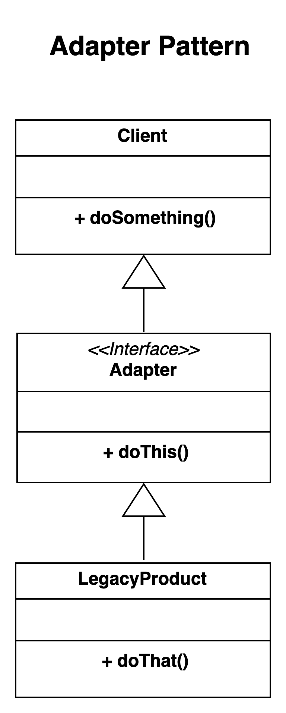

# Adapter pattern.

### Overview
The adapter pattern is a great structural pattern that is used to connect new code to legacy code
without having to change the implementation of the original legacy code. You can have multiple 
adapters in a the same application depending on your need

### Concepts
- Converter to another interface
- Legacy
- Translate requests
- Client talks to the Adaptee using the adapter

### Examples
- The collections API (List) - specifically Arrays.asList
    - use to convert an array into a List without altering the source array. 
      - the array are originally what you will consider as the legacy pattern
- The streams API - IO Streams

### Design:
- Adapter are client centric in nature
- Integrate new with old