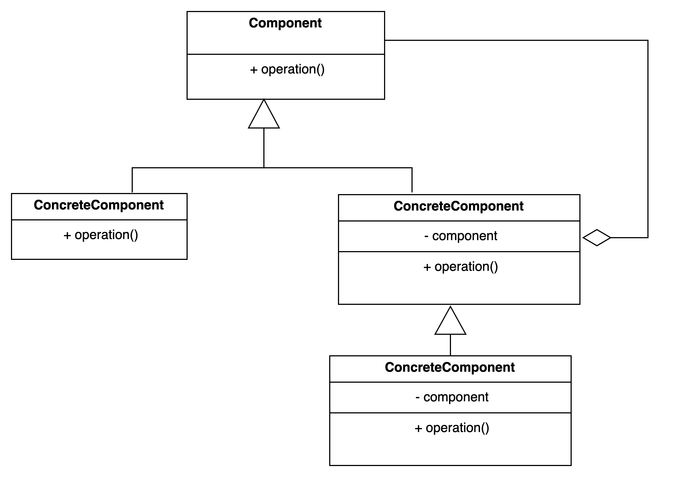

# Decorator pattern.

### Overview
The decorator pattern is a hierarchical type pattern that builds functionalities 
at each level while using composition from similar data types

### Concepts
- When you want to wrap another object to add functionalities to it.
- Add behaviour to an object without affecting other parts of the object if you don't want to.
- It is more than just simple inheritance, you are controlling which pieces complements your 
   object not necessarily trying to override it like in an inheritance
- It follows the single responsibility principle
- compose behaviour dynamically. This feature makes it look like a creational design pattern
  but it is actually adding a behaviour through creation

### Examples
- Java.io.InputStream classes
- Java.util.Collections#checkedList
- All UI components are implemented using this pattern

### Design:
- Inheritance based
- It utilizes composition and inheritance to achieve its objective. (is-a, has-a)
- It is an alternative to subclassing because it adheres to the single responsibility principle.
- The constructor requires an instance of the component from the hierarchy which enables us to build upon 
  that and use composition rather than inheritance to override which individual field iit wants to