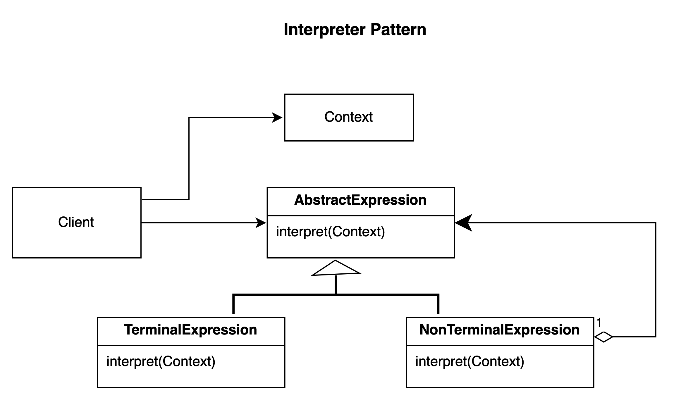

# Interpreter pattern.

### Overview
This is a behavioural pattern that you use to represent the grammar of a language

### Concepts
- It represents a grammar. e.g music notation, mathematical equations or even other language
- Compilers will use the interpreter design pattern to parse source code often times
- The grammar it represents can then be used to interpret a sentence.
- The sentences are consequently used to map out a domain specific language (DSL) e.g SQL, XML parser
- We often see an interpreter used when defining an abstract syntax tree (AST)

### Examples:
- java.util.Pattern api - compiled regex
- javax.text.Format api - an abstract base class used to represent a local sensitive content
