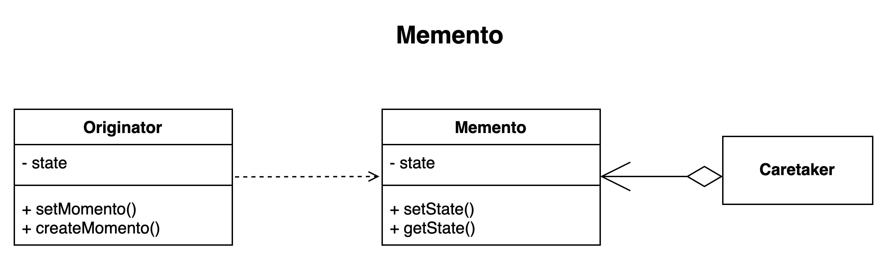

# Memento pattern.

### Overview
The memento is use to externalize an object state usually to provide rollback functionality.

### Concepts
- Restore object to its previous state.
- it shields complex internals from other objects
- Undo/Rollback functionality

### Examples:
- java.util.Date Object 
- java.io.Serializable interface

### Design:
- The design is Class based, 
  - Originator, Caretaker, Memento