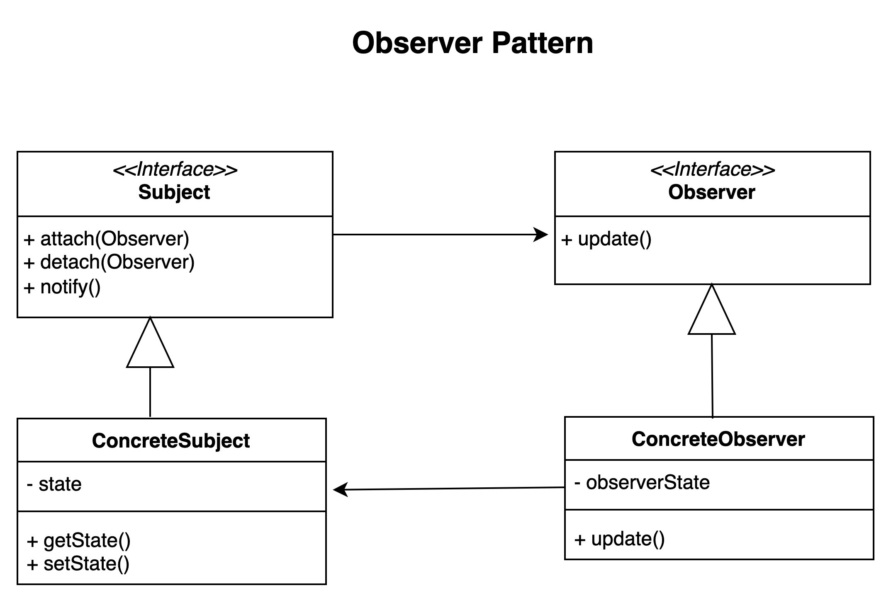

# Observer pattern.

### Overview
The observer pattern is a decoupling pattern that is used when we have a subject that needs to be observed by one or more observers.

### Concepts
- When we have a situation where a subject has One-to-Many observers
- Usually when you are trying to decoupled objects (observers in this case)
- Event handling capabilities
- Pub/Sub scenarios
- MVC situations where the view is event driven

### Examples:
- java.util.Observer API
- java.util.EventListener API
- javax.jms.Topic - when implementing topics for message driven application

### Design:
- A subject that needs to be observed. The subject is a class that the observers would need to register themselves with.
  - In the case of java, the subject implements an observable interface
- The Observer is interface based with various concrete implementation
- Concrete Observers are typically views in an event driven application
